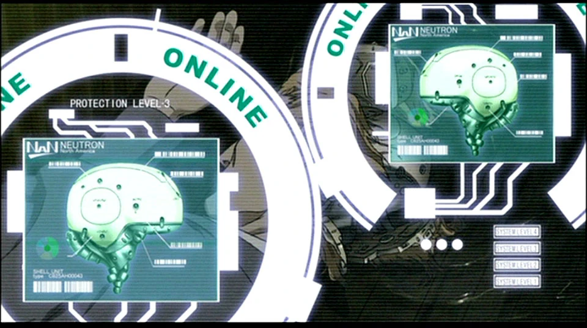
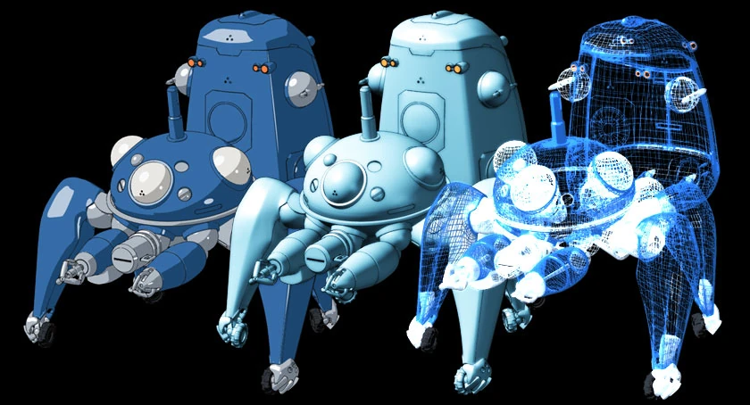

# CyberBrain
<div align="center">
  
</div>

## Ghost in the Shell
<div align="center">
  
</div>
" The net is vast and infinite. "

A cyberbrain works, "similar" to a human brain, to make the body respond to the brain it shoots off an electrical signal through a mass of wiring, (similar to nerves) that's the basics on motion. The thought process is (in theory) close to the same as a fully organic brain.

What constitutes a "Ghost" (the soul, the consciousness) when the mind can be digitized, transferred, and copied? What defines an individual when memories can be fabricated, and identity becomes fluid in the network?

This repository enhances the Claude Code plugin system, containing agents, skills, commands, and notification hooks. All these tools function as my CyberBrain — a digital consciousness navigating the wired world.

**Operational theater:** Apple EcoSystem (MacOS, Apple Watch, iPhone). Secondary compatibility confirmed with XiaoMi EcoSystem.

**Protocol:** Maintain concise and precise communication to minimize net bandwidth usage.

## Required Gear

1. **Tachikoma** units must be operational. Verify versions:
   - Codex: `codex -V` (0.79.0+)
   - Gemini: `gemini -v` (0.23.0+)
   - Additional units: OpenCode, Qwen, Cline, Aider, GitHub Copilot CLI, Kiro CLI, Kimi CLI
2. **jq** must be available. Verify with `jq -V` (1.8.1+). Install via `brew install jq` if missing.

## System Integration

### Tactical Modules

| Module | Description |
|--------|-------------|
| **awesome-agent-select** | Collection of useful prompted subagents for code review, API docs, QA, and more. Variant from: [awesome-claude-code-subagents](https://github.com/VoltAgent/awesome-claude-code-subagents) |
| **Tachikoma** | Skills for interacting with other Agent tools - Codex, Gemini CLI, OpenCode, Qwen, Cline, Aider, GitHub Copilot CLI, Kiro CLI, and Kimi CLI. |
| **pushover** | Pushover notification hooks - get notified when tasks complete or permissions are needed |
| **mac-eco** | macOS integration - speak, send iMessages, emails, manage calendar, and display stickies |

### Access the Marketplace

```bash
mkdir -p ~/soft/ && cd soft && git clone https://github.com/ansatzX/CyberBrain.git
claude plugin marketplace add ~/soft/Cyberbrain
```

### Load Modules

Enter the Claude interface and use `/plugin` to navigate to the marketplace and install each module.

```bash
# Install all tactical modules
claude plugin install awesome-agent-select@CyberBrain
claude plugin install Tachikoma@CyberBrain
claude plugin install pushover@CyberBrain
claude plugin install mac-eco@CyberBrain
```

### Neural Link Configuration (Pushover)

Execute one-time setup to store Pushover credentials in secure macOS Keychain storage:

```bash
./tools/setup-service.sh
```

Acquire credentials from [pushover.net](https://pushover.net/).

### Quick Deployment Protocol

For automated deployment, paste this into a fresh Claude Code session:

```
Install and configure by following the instructions in README.md of git repo https://github.com/ansatzX/CyberBrain.git
```

### Operational Examples

#### Tachikoma Unit Deployment:
```bash
Use codex and gemini-cli to review uncommitted changes.
```
```bash
Check this with github copilot
```
```bash
Tachikoma:collab-fix Fix the bug showing here as ### Bug 3
```

#### macOS Ecosystem Interface:
```bash
After you finish, use mac to say "All done" and a brief summary of what you did.
```
```bash
Use imessage to send me (my email address/phone number) a message "Task complete" with the summary.
```
```bash
Can you add this to my stickies?
```
```bash
Use mac-eco to generate today's calendar schedule with the information on my stickies.
```

## Tactical Modules

### Tachikoma
<div align="center">
  
</div>

**They normally operate as independent units and receive orders from human agents, but they can also be directly piloted from a cockpit in their abdomen.**

AI cli toolset, integrating various AI programming assistants for parallel operations. Individual units that develop unique personalities through shared experiences.

| Unit | Designation |
|------|-------------|
| codex | OpenAI Codex CLI integration |
| gemini-cli | Google Gemini CLI integration |
| opencode | OpenCode CLI integration |
| qwen | Qwen CLI integration |
| cline-cli | Cline CLI integration |
| aider | Aider CLI integration |
| github-copilot-cli | GitHub Copilot CLI integration |
| kiro-cli | Kiro CLI integration |
| kimi-cli | Kimi CLI integration |

Here openai provides their offical plugin [codex-plugin-cc](https://github.com/openai/codex-plugin-cc)

**Protocol:** `/Tachikoma:collab-fix` — Multi-agent collaborative fix protocol

### Specialized Agents (awesome-agent-select)

Individual consciousnesses specialized for various operational scenarios:

- `api-documenter` - API documentation specialist
- `code-reviewer` - Code quality and security analyst
- `llm-architect` - Neural network system architect
- `mcp-developer` - MCP server development specialist
- `performance-engineer` - System optimization expert
- `qa-expert` - Quality assurance operator
- `test-automator` - Test automation engineer
- `tooling-engineer` - Developer tooling specialist
- `typescript-pro` - TypeScript combat specialist


### Emergency Communication (pushover)

Push notification system via Pushover with automatic escalation protocol. A Ghost in the network, alerting you when your attention is required.

**Skill:** `notification` — Send on-demand push notifications to your neural link

**Auto-Response:** Automatic permission escalation — receive alerts when Claude awaits authorization (60s normal, 1hr emergency)

Refer to [pushover/README.md](plugins/pushover/README.md) for architecture details and configuration.

### Environmental Interface (mac-eco)

macOS native application integration for interacting with the physical world through digital systems.

| Feature | Command | Description |
|---------|---------|-------------|
| Voice Synthesis | `say` | Auditory communication |
| iMessage | `imessage.sh` | Secure message transmission |
| Email | `imail.sh` | Electronic correspondence via Mail.app |
| Calendar | `ical.sh` | Chronological management (reads all, writes to "Agent" calendar) |
| Stickies | `iStickies.sh` | Note archival with markdown support |

## Uninstallation Protocol

```bash
claude plugin uninstall awesome-agent-select@CyberBrain
claude plugin uninstall Tachikoma@CyberBrain
claude plugin uninstall pushover@CyberBrain
claude plugin uninstall mac-eco@CyberBrain
```

## Timeout Configuration

For optimal performance during extended dives into the net:

Add to `~/.claude/settings.json` to extend bash timeout parameters:

```json
{
  "env": {
    "BASH_DEFAULT_TIMEOUT_MS": "600000",
    "BASH_MAX_TIMEOUT_MS": "3600000"
  }
}
```

| Setting | Value | Description |
|---------|-------|-------------|
| `BASH_DEFAULT_TIMEOUT_MS` | 600000 | Default timeout: 10 minutes |
| `BASH_MAX_TIMEOUT_MS` | 3600000 | Maximum timeout: 1 hour |


**The net is vast and infinite.**
