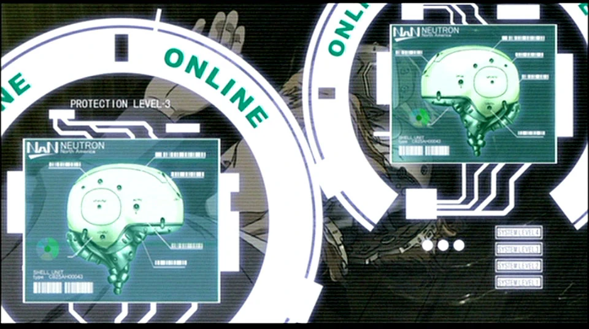

# CyberBrain

<div align="center">
  
  <br/>
  
</div>

CyberBrain is a personal agent configuration repository with first-class host adapters for OpenAI Codex and Pi. Shared skills remain single-source; each host keeps its native package, extension, and installer mechanisms.

## Host Adapters

- **Codex**: local marketplace plugins plus explicit agent-role installation.
- **Pi**: local `cyberbrain-pi` package with extensions, providers, slash modes, subagents, and shared skills.

## Active Plugins

| Plugin | Contents | Status |
| -------- | ---------- | -------- |
| `awesome-agent-select` | Host-neutral prompted roles rendered for Codex and Pi: review, QA, API docs, performance, tooling, TypeScript work, and tachikoma delegation | Published |
| `tachikoma` | Skills for coordinating Codex, Gemini CLI, OpenCode, Qwen, GitHub Copilot CLI, Kimi Code, and Pi | Published |
| `brain` | Skills for epistemic audits, calculation boundaries, scientific-claim review, and whole-object responsibility | Published |

## Requirements

- Optional CLI tools used by `tachikoma`: Gemini CLI, OpenCode, Qwen, GitHub Copilot CLI, Kimi Code, Pi
- Verify the installed CLI interface before first use. Reuse verified evidence
  within a session while the executable and relevant configuration are unchanged;
  recheck after upgrades or environment changes. A newer version still needs
  compatibility verification.
- Development checks use Node’s built-in TypeScript support, Python 3 and Bash.
  The separate [skill gate](pi/test/evals/README.md) requires the exact tested
  pi-subagents toolchain recorded in `pi/test/skill-runtime.json`.

## Codex Installation

Clone and register the marketplace:

```bash
mkdir -p ~/soft
git clone https://github.com/ansatzX/CyberBrain.git ~/soft/CyberBrain
cd ~/soft/CyberBrain
codex plugin marketplace add ~/soft/CyberBrain
```

Install plugins through the interactive plugin browser:

```bash
codex
/plugins
```

In the plugin browser, switch to the **CyberBrain** marketplace tab and install each plugin.
Press <kbd>Space</kbd> on an installed plugin to toggle its enabled state.
To remove the marketplace: `codex plugin marketplace remove CyberBrain`.

### Agent Roles (awesome-agent-select)

Install `awesome-agent-select` from `/plugins`, then explicitly install its Codex agent roles:

```bash
bash tools/awesome-agent-select-codex-agents.sh install
```

This copies the generated `agents/*.toml` files into `~/.codex/agents/` and writes a manifest so later `doctor` and `uninstall` operations touch only files owned by `awesome-agent-select`.

Check status:

```bash
bash tools/awesome-agent-select-codex-agents.sh doctor
```

Remove only managed agent files:

```bash
bash tools/awesome-agent-select-codex-agents.sh uninstall
```

This explicit installer is the only supported installation path for Codex agent roles in `awesome-agent-select`.

To clean up agent symlinks from all plugins:

```bash
bash tools/cleanup-agent-symlinks.sh
```

## Pi Installation

Clone the repository, install the `pi-subagents` and `pi-lens` Pi packages, then run the managed installer:

```bash
mkdir -p ~/soft
git clone https://github.com/ansatzX/CyberBrain.git ~/soft/CyberBrain
cd ~/soft/CyberBrain
pi install npm:pi-subagents
pi install npm:pi-lens
bash tools/manage-pi.sh install
bash tools/manage-pi.sh doctor
```

The default doctor is an installation smoke check and loads all runtime modules in one Node process. Use `bash tools/manage-pi.sh doctor --full` for the complete developer test suites; they are deliberately not part of new-machine installation.

The Pi adapter does not manage credentials, sessions, goals, model preferences, themes, or thinking settings. Its `pick-model` skill picks model and thinking level per delegated launch (preserving configured role/default resolution, with parent-session fallback), and `agent-cluster` drives multi-agent launch, supervision, and fan-in; neither persists model choices on its own. See [INSTALL.md](INSTALL.md) for the full install, update, and uninstall guide,
and [pi/README.md](pi/README.md) for package development. Use `--pi-home` for
installer checks in a separate configuration directory, and the same
`PI_CODING_AGENT_DIR` when subsequently running Pi.

### Long-running goals (`/ansatz:goal`)

`/ansatz:goal set <objective>` pins an objective that survives across turns: after each settled agent run, an active goal queues one follow-up turn automatically, so a long task keeps moving without re-prompting. The model interacts only through `get_goal` / `create_goal` / `update_goal`; `update_goal` accepts `complete` (with a reason) or `blocked` (only after the same obstruction is reported in at least three distinct turns, matched semantically so re-wording the same blocker still accumulates).

Unattended work is bounded by five budgets (`pi/lib/goal-core.ts`). Exhausting any of them parks the goal as `paused`, preserving its objective and `goal_id`; `/ansatz:goal resume` grants a fresh budget:

| Budget | Default | Env | Catches |
| -------- | --------- | ----- | --------- |
| Turn | 10 | `CYBERBRAIN_GOAL_TURN_BUDGET` | a model that never marks the goal complete |
| Idle | 3 | `CYBERBRAIN_GOAL_IDLE_BUDGET` | turns that only inspect state instead of acting |
| Error | 2 | `CYBERBRAIN_GOAL_ERROR_BUDGET` | looping on a broken state after retries are exhausted |
| Model turns | 100 | `CYBERBRAIN_GOAL_MODEL_TURN_BUDGET` | tool loops within a single run; checked before each model turn |
| Wall time | 1800000 ms (30 min) | `CYBERBRAIN_GOAL_TIME_BUDGET_MS` | stalled requests/tools; timer requests abort even without new events |

Progress is judged on tool *results*: read-only tools, failed calls, and the goal tools themselves never count as progress, and a `bash` call is classified by inspecting its command. Esc (`aborted`) pauses the goal and cancels pending continuation without charging the error budget. Set any budget to `off` or `0` to disable it. Model-turn counts and the wall deadline persist across automatic continuations; only explicit resume resets them. Abort uses Pi's cooperative cancellation and cannot forcibly stop an external process that ignores cancellation.

Restart/reload/session re-entry pauses a saved active goal; use `/ansatz:goal resume` to recover it with the same identity and objective. Pause, clear, and session shutdown cancel locally scheduled continuation before dispatch. Goal lock timeout fails without writing; lock age alone never justifies stealing ownership. For a confirmed orphan, stop every writer before removing the exact lock directory reported in the error and retrying.

### models.json refresh

The custom DeepSeek extension is `pi/extensions/deepseek-full.ts`, backed by `pi/lib/third-party/deepseek-full.ts`, with provider ID `deepseek-full` and display name `DeepSeek Full · 全功能`, distinct from built-in `deepseek`. It registers only `deepseek-flash` and `deepseek-v4-pro` (display names equal IDs).

`CYBERBRAIN_DEEPSEEK_PROTOCOL=anthropic` is the default: `anthropic-messages` at `https://api.deepseek.com/anthropic`. Set `CYBERBRAIN_DEEPSEEK_PROTOCOL=responses` before starting Pi to use `openai-responses` at `https://api.deepseek.com`. Unknown values fail explicitly. Registration, request hooks and the catalog mirror use the same startup configuration. Restart after changing protocol; external catalog readers need a refreshed catalog. For upgrades, follow the complete package update in [INSTALL.md](INSTALL.md#更新), not per-file replacement instructions.

Anthropic mode injects `web_search_20250305` for both models with `max_uses: 3`. Responses mode injects `web_search` only for Pro (Flash Responses did not execute search in live testing). `CYBERBRAIN_DEEPSEEK_WEB_SEARCH=0` disables automatic injection in either mode. Injection makes a tool available; it does not force the model to search. Pi's current Anthropic adapter renders final text but does not retain raw server-search result blocks in its normalized message history; source links in final text are not a guarantee of structured citation preservation.

Protocol selection is process-scoped. A shell override does not change an already-running Pi or Raft process. Use `deepseek-full/<model>` in model selection; built-in `deepseek/<model>` is a separate provider. Package updates preserve user preferences, credentials and session history; changes to those preferences need authorization.

Providers register in-process via `pi.registerProvider`, which only affects the current pi process — consumers that read `models.json` directly (e.g. the Raft daemon's model detection) never see them. To fix that, every pi startup also refreshes the `aihubmix`, `deepseek-full` and `cuhksz` provider sections of `models.json` (`pi/lib/third-party/models-json.ts`):

- Refuses to touch an unparseable `models.json`; rewrites its own provider section and explicitly owned legacy IDs during migration, preserving unrelated providers and all other keys.
- Skips the write entirely when nothing changed; otherwise writes atomically (temp file + rename), round-trip-validates the JSON before and after writing, and snapshots the previous file to `models.json.bak` for rollback.
- Serializes Cyberbrain writers across processes with a directory lock covering read, write, validation, and rollback. A backup failure leaves the current file unchanged. Lock acquisition times out after five seconds; after a crashed writer, stop all writers before removing the stale `models.json.lock` directory and retrying.
- Refresh failures only warn — the in-process provider registration is never blocked, and for `deepseek-full` the refresh is deliberately kept out of the synchronous registration path so disk I/O can never delay or break it.

| Provider | Path override | Kill switch |
| ---------- | --------------- | ------------- |
| `aihubmix` | `AIHUBMIX_MODELS_JSON_PATH` | `AIHUBMIX_MODELS_JSON_REFRESH=off` |
| `deepseek-full` | `CYBERBRAIN_DEEPSEEK_MODELS_JSON_PATH` | `CYBERBRAIN_DEEPSEEK_MODELS_JSON_REFRESH=off` |
| `cuhksz` | `CUHKSZ_MODELS_JSON_PATH` | `CUHKSZ_MODELS_JSON_REFRESH=off` |

All default to `$PI_CODING_AGENT_DIR/models.json`, falling back to `~/.pi/agent/models.json`.

Without a nonempty `AIHUBMIX_API_KEY`, `aihubmix` skips startup silently: no discovery, registration, or models.json refresh. `cuhksz` logs a disabled warning when its key is missing.

`cuhksz` registers only `glm-5-fp8`, with a fixed 256K (262144 tokens) context window. Cached or live probe metadata cannot override this setting; output is capped at the context window. `CUHKSZ_MODELS` no longer changes the model selection.

The `aihubmix` catalog is written grouped by vendor, newest version first within each group. Upstream reports every model with the same `created` constant, so the version embedded in the id is the only usable release signal; date stamps (`o1-2024-12-17`) and parameter counts (`gpt-oss-120b`) are deliberately excluded from that comparison.

### Pi Package Contents

| Resource | Source | What you get |
| ---------- | -------- | -------------- |
| Extensions | `pi/extensions/` | `/ansatz:goal` long-task goals with budgeted auto-continuation, `/ansatz:diff`, `/ansatz:status`, slash-mode framework (`/ansatz:review`, `/ansatz:python`) |
| Providers | `pi/lib/third-party/` | `aihubmix/*` (live model discovery), `deepseek-full/deepseek-flash` / `deepseek-v4-pro` (1M context; flash exposes low/high/max, pro exposes high/max), and `cuhksz/glm-5-fp8` (fixed single model, 256K context, `models.json` mirror) |
| Skills | `pi/skills/` | `pick-model` (per-launch model/thinking routing), `agent-cluster` (multi-agent lifecycle), `pi-extension-dev` |
| Shared skills | `plugins/*/skills/` | brain, tachikoma, and awesome-agent-select skills, loaded single-source |
| Subagents | `pi/subagents/` | generated `cyberbrain.<role>` agents from `awesome-agent-select` profiles, e.g. `/run cyberbrain.code-reviewer` |
| Dependency | npm `pi-subagents` | subagent delegation engine (single calls and `workflowScript` for dependent/parallel work and async supervision), installed separately as a Pi package (`pi install npm:pi-subagents`) |
| Dependency | npm `pi-lens` | real-time code feedback (LSP, linters, formatters, type-checking), installed separately as a Pi package (`pi install npm:pi-lens`) |

## Plugin Layout

```text
.agents/plugins/marketplace.json       # Codex marketplace
tools/
  awesome-agent-select-codex-agents.sh  # explicit install / doctor / uninstall wrapper
  cleanup-agent-symlinks.sh            # batch cleanup of agent role symlinks
  generate-agent-adapters.mjs          # render canonical roles for both hosts
  validate-skills.mjs                  # required skill compatibility gate
plugins/
  awesome-agent-select/
    .codex-plugin/plugin.json
    agent-profiles/                    # canonical host-neutral role text
    agents/                            # generated Codex agent TOMLs
    skills/
    tools/
      manage-codex-agents.sh           # canonical installer used by explicit wrapper
  tachikoma/
    .codex-plugin/plugin.json
    skills/
  brain/
    .codex-plugin/plugin.json
    skills/
pi/
  skills/                             # Pi guides, conditional references and workflow examples
  test/contracts/                     # skill runtime and metadata checks
  test/evals/                         # behavioral cases and evaluation guide
  subagents/awesome-agent-select/      # generated Pi subagent Markdown adapters
```

## Plugin Details

### `tachikoma`

<div align="center">
  
</div>

`tachikoma` provides external AI CLI coordination skills through the Codex plugin
and the Pi package’s shared-skill references. Each host uses its own execution
tools; installing a skill does not install the external CLI.

A verified one-call task captures output and exit status without mandatory durable
coordinator files. Multi-round, background and resumable tasks keep a session log
and summary. Resume preserves the actual session and exact tool boundary; Pi tool
allowlists do not constrain arbitrary extension startup code or provide an OS sandbox.

Included skills:

- `codex`
- `gemini-cli`
- `opencode`
- `qwen`
- `github-copilot-cli`
- `kimi-code`
- `pi`

### `brain`

`brain` provides audit-oriented skills for scientific, technical, workflow, and search-evidence reasoning.

Included skills:

- `using-ansatz-brain`
- `state-machine`
- `agentic-search`
- `codex-compatible`
- `think-before-you-calculate`
- `epistemic-systems-audit`
- `whole-object-responsibility`
- `tame-dev-workflows`

Ordinary answers and read-only reviews use an internal check without state files.
Scientific experiment design and interpretation activate `think-before-you-calculate`;
ordinary builds, scripts and unit tests do not require its full audit. Detailed
scientific and system reviews load their specialized guidance when relevant.

The following state-machine tooling is planned, not shipped:

- Add a validator that checks state nodes for completion without verification, proxy-only evidence marked verified, unresolved object drift, and open gaps before `CLAIM_READY`.
- Add a summarizer that rolls child agent state nodes up into a parent node without requiring concurrent writes to the same file.
- Add optional schema export for tools that want to read `.state-machine/*.md` as structured records.

### `awesome-agent-select`

`awesome-agent-select` provides prompted subagents and the `team-leader` skill.
The skill defines task ownership, bounded launches, takeover and acceptance; it
does not require a team for small tasks or authorize new work after completion.

Included agents:

- `api-documenter`
- `code-reviewer`
- `llm-architect`
- `mcp-developer`
- `performance-engineer`
- `qa-expert`
- `test-automator`
- `tooling-engineer`
- `typescript-pro`
- `tachikoma-runner`

In Codex, the supported installation path is an explicit installer that copies `agents/*.toml` into `~/.codex/agents/` and writes a local manifest.

| File | Format | Consumer |
| ------ | -------- | ---------- |
| `agent-profiles/*.md` | description paragraph followed by role instructions; no frontmatter | Canonical source |
| `agents/*.toml` | `name` + `description` + `developer_instructions` | Codex (generated) |
| `pi/subagents/awesome-agent-select/*.md` | Pi subagent frontmatter plus role instructions | Pi (generated) |

Edit only `agent-profiles/*.md`: the filename is the role name, the first paragraph is its description, and the remaining text is its instructions. Regenerate both host adapters with:

```bash
node tools/generate-agent-adapters.mjs
node tools/generate-agent-adapters.mjs --check
```

Codex discovers agent roles from `~/.codex/agents/*.toml` during startup. `bash tools/awesome-agent-select-codex-agents.sh install` is the supported way to populate that directory. Pi discovers the packaged roles as `cyberbrain.<role-name>` after `/reload`; for example: `/run cyberbrain.code-reviewer "Review the current diff without edits"`.

**Install**: Use `/plugins` in the Codex interactive CLI to install from the CyberBrain marketplace, then run `bash tools/awesome-agent-select-codex-agents.sh install`. Start a new Codex session after the install so the newly copied agent roles are discovered.

**Verify**: Run `bash tools/awesome-agent-select-codex-agents.sh doctor`.

**Uninstall**: Run `bash tools/awesome-agent-select-codex-agents.sh uninstall` to remove only managed files. If you previously used the legacy symlink-based flow, `bash tools/cleanup-agent-symlinks.sh` removes leftover symlinks. Plugin uninstall through `/plugins` still does not have an uninstall hook in Codex itself.

## Validation

Validate marketplace and plugin JSON:

```bash
jq -e . .agents/plugins/marketplace.json plugins/*/.codex-plugin/plugin.json
```

Run the required skill gate (dependency setup and behavioral evaluation are described in [skill validation](pi/test/evals/README.md)):

```bash
node tools/validate-skills.mjs
```

The gate fails on missing or mismatched dependencies and uses mocked child launches;
it does not call models. For substantive routing or workflow edits, also use the
independent trigger/decision scenarios in the linked guide. Passing automated
checks alone is not behavioral validation.

For Pi runtime and installer changes, run the relevant checks listed in
[Pi development](pi/README.md#development). Role changes must be made in canonical
profiles and regenerated; installer/discovery changes should also be checked in
temporary Codex and Pi configuration homes.

DeepSeek metadata was checked against [official pricing](https://api-docs.deepseek.com/quick_start/pricing/) on 2026-09-15. Only `deepseek-flash` (V4.1 Flash with image input) and `deepseek-v4-pro` are registered; legacy Flash aliases are not listed. Cost estimates use peak USD rates per million tokens (Flash: input 0.30, output 1.20, cache read 0.006; Pro: 1.32, 3.96, 0.044); off-peak billing is half. Search support is protocol-specific; see the configuration above.
