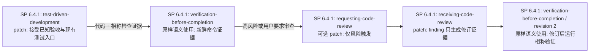
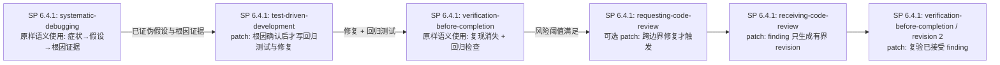
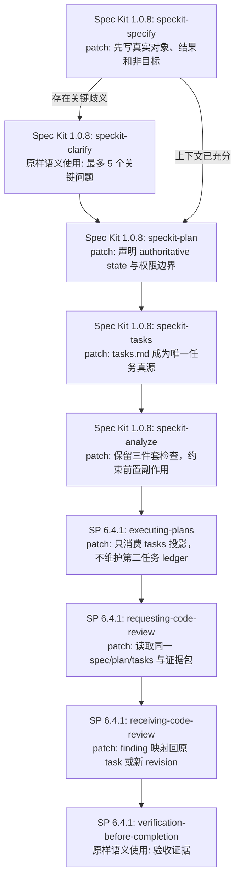
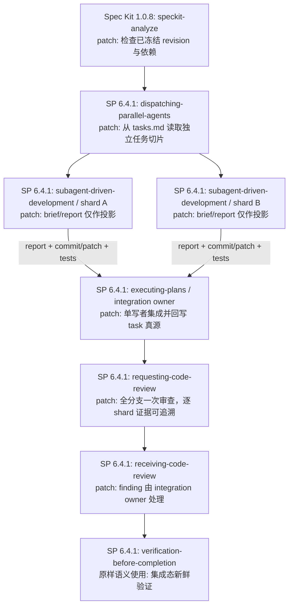
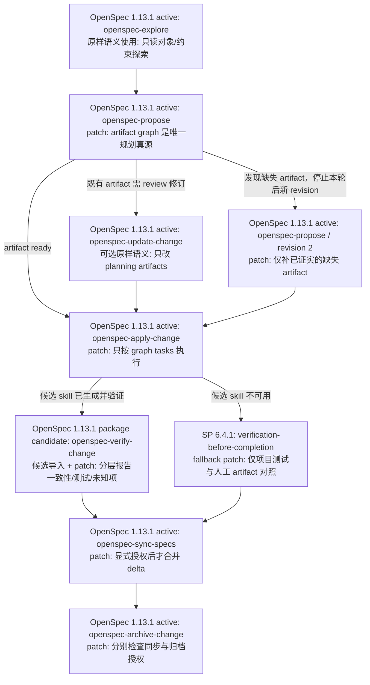

# Ansatz 开发工作流 DAG：三套工具的虚拟裁剪设计

## 1. 文档状态与证据边界

本文是一份**虚拟编排设计**，不是安装说明，也不是已经可运行的工作流。
设计只依据以下受控材料：

- `reference/superpowers.md`：Superpowers 6.4.1 的源码地图；
- `reference/spec-kit.md`：Spec Kit 1.0.8 与 bundled `speckit` workflow 1.0.1 的源码地图；
- `reference/openspec.md`：OpenSpec 1.13.1 的源码地图；
- Ansatz 本仓库的 `using-ansatz-brain`、`state-machine`、
  `whole-object-responsibility`、`think-before-you-calculate` 和
  `epistemic-systems-audit` 原则。

初稿编排阶段仅依据 reference，未加载上游 skill 正文。随后三名按包分工的审查代理只读核对了
实际 skills、脚本和模板；本文已吸收源码对齐修正。两个阶段均未执行上游工作流、初始化项目、
复制 skill、生成代理或修改 vendor。reference 是能力图，
单独不足以证明逐行接口；源码复核也不证明宿主权限强制效果或组合后的运行正确性。因此本文可确定
“选择什么、为什么选择、计划改什么、用什么验收”，不能声称已经生成可应用的补丁或通过
真实运行验收。

版本口径固定为上述快照。OpenSpec 的 `verify` 是 1.13.1 包内可生成 workflow ID，生成 skill 名为 `openspec-verify-change`，
不是当前 active vendor 已生成的六个 skill 之一；凡使用它的场景都标为“候选导入”，
必须先在 staging 中从同版本包生成并验证，不能假定现成可用。Spec Kit 的模板可被
override、preset 或 extension 改写；OpenSpec 的项目 schema 也可改写 artifact 图，
所以本文以“解析后的路径/图”为接口，不硬编码它们必然等于默认文件名。

## 2. 总体约束：选择 M 个组件，而不是叠加 N 套流程

Ansatz 只提供路由、对象边界、证据边界和责任约束，不成为第四套实现流水线。
每个请求先按变更后果选择最小场景；普通小任务不创建 spec、change、ledger 或审计表。

每个场景必须满足以下不变量：

1. **一个对象**：入口先写清用户要改变的真实对象与可观察结果，不能用“跑完流程”替代。
   用户的明确授权、既有约束和已经提供的上下文优先；有充分上下文的小修复不重复需求澄清，
   也不重新索取已有授权。
2. **一个任务真源**：同一场景只能有一个 authoritative task state。其他计划、brief、
   issue、review package 和执行日志都是只读投影或证据，不得反向争夺完成状态。
3. **一个写入所有者**：同一时刻每个 authoritative artifact 只有一个写入者；并行只用于
   无共享写状态的任务。
4. **结论受证据约束**：artifact 存在、命令退出 0、测试通过、科学结论分别是不同层次。
   只声明新鲜证据真正支持的层次。
5. **权限不随路由扩张**：规划不授权实现，代码修改不授权发 issue、同步主 specs、归档、
   合并、清理工作树或提交外部反馈。这些动作必须沿用宿主权限与用户授权；每个边界分别检查
   权限覆盖，但已有明确授权覆盖后不重复询问。
6. **恢复点有真实载体**：需要恢复时记录版本、输入快照、authoritative task ID、执行结果、
   验证证据和下一步；不为一次性小任务制造持久状态。
7. **DAG 不画回边**：返工建立 `revision n+1` 节点并让它依赖失败证据；旧 revision 保持不可变，
   因而执行图始终无环。新 revision 只能承接已经证实的缺口；不得把反复 analyze/converge
   或无界“继续完善”当成默认循环。
8. **科学约束不是上游能力声明**：若某场景确实涉及科学 claim，只能通过选中 skill 的明确
   Ansatz patch 注入 question/object/proxy/evidence 边界，并在补丁中标出来源；不能写成三套
   上游工具已经实现该审计。普通工程 build、test、benchmark 执行不因此套用科学审计。

### 2.1 场景路由

| 场景 | 进入条件 | 任务真源 | 记录级别 | 不应进入 |
| --- | --- | --- | --- | --- |
| A 小而明确的代码改动 | 目标、范围、验收均清楚；低协调成本 | 用户请求 + 当前代码；无持久 tasks | L1，或无恢复需要时仅简短执行记录 | 不建 Spec Kit/OpenSpec 状态，不写计划文档 |
| B 现有行为故障定位 | 有可复现症状但根因未知 | 调试假设/证据链；无规划 tasks | L1/L2 | 不先写 feature spec，不以 TDD 失败代替根因定位 |
| C 新功能的规格驱动实现 | 多项需求、跨组件、需 reviewer 追踪 | Spec Kit 解析后的 `tasks.md` | L2 | 不再生成 Superpowers plan 或 OpenSpec tasks |
| D 可恢复的并行实现 | 已有稳定计划；任务可证明相互独立；需多执行者恢复 | Spec Kit `tasks.md` | L3 | 任务共享写状态或计划仍在变化时不进入 |
| E 既有系统的契约演进 | 需要显式 delta、主规格同步和归档 | OpenSpec change 的 artifact graph/tasks | L2/L3 | 单文件修复、没有长期规格资产时不进入 |

若请求同时命中多个场景，按真实瓶颈选择一个主场景。例如“新增功能时发现测试失败”，
若失败阻断需求理解先走 B，根因结论成为 C 的输入；不要同时启动两套任务真源。
科学计算或 benchmark 仅在结论涉及科学解释时增加 Ansatz 的证据约束；普通 build/test
不触发额外科学审计。

### 2.2 N→M 选用清单

下表按 reference 中列出的全部技能/workflow 盘点。`选` 表示至少进入一个 DAG；`条件选`
表示只在图示条件成立时进入；`不选` 表示不进入本设计的运行 DAG，不代表该组件没有价值。

跨场景去重后：Superpowers **15→8**；Spec Kit **10→5**；OpenSpec 从 **6 个已生成 + 6 个包内 workflow + 1 个 feedback 模板**中选 **6 个已生成 + 1 个候选 verify**。这些是候选并集，不是一次请求全部加载。

| 来源 | 技能/workflow | 决定 | 理由 |
| --- | --- | --- | --- |
| Superpowers 6.4.1 | `using-superpowers` | 不选 | 由本设计的单一场景 router 取代，避免第二路由器 |
|  | `brainstorming` | 不选 | C/E 已有规划真源；A/B 上下文足够时不重复澄清 |
|  | `writing-plans` | 不选 | C 用 Spec Kit plan/tasks，E 用 OpenSpec graph |
|  | `test-driven-development` | 条件选 A/B | 仅局部实现/根因确认后的回归纪律 |
|  | `systematic-debugging` | 选 B | 唯一诊断证据链 |
|  | `using-git-worktrees` | 不选 | 隔离策略取决于宿主/仓库，非五个场景的必经节点 |
|  | `subagent-driven-development` | 条件选 D | 只在任务独立且获准多执行者时作 shard 投影 |
|  | `executing-plans` | 选 C/D | 经 patch 消费唯一 task 真源；D 仅作集成 owner |
|  | `dispatching-parallel-agents` | 条件选 D | 只调度无共享写状态的任务 |
|  | `requesting-code-review` | 条件选 A/B，选 C/D | 风险触发或规格场景 gate，不拥有任务状态 |
|  | `receiving-code-review` | 与 review 配对 | 逐项处理 findings，输出修订证据但不自立 tasks |
|  | `verification-before-completion` | 选 A--D，条件选 E | 以新鲜证据约束完成声明 |
|  | `finishing-a-development-branch` | 不选 | merge/PR/保留/清理超出实现与验证默认权限 |
|  | `diagnosing-superpowers` | 不选 | 审计 Superpowers 自身，不处理用户开发对象且有额外 home I/O |
|  | `writing-skills` | 不选 | 未来 staging patch 制作另行验证，不作为运行 DAG |
| Spec Kit 1.0.8 | `speckit-specify` | 选 C | feature 需求真源入口 |
|  | `speckit-clarify` | 条件选 C | 仅有关键歧义时，最多五问 |
|  | `speckit-constitution` | 不选 | 读取既有 constitution；不把治理文件维护塞进功能流 |
|  | `speckit-plan` | 选 C | 形成实现设计，接受解析后的模板层 |
|  | `speckit-tasks` | 选 C/D | 唯一任务真源 |
|  | `speckit-implement` | 不选 | 与 patched `executing-plans` 重复执行/勾选 |
|  | `speckit-analyze` | 选 C/D | 三件套齐备后只读 gate；D 检查冻结 revision |
|  | `speckit-converge` | 不选 | append-only 补任务容易形成默认无界收敛；缺口走有界 revision |
|  | `speckit-checklist` | 不选 | 本设计以 spec/analyze/review gate 管需求质量，避免再添状态表 |
|  | `speckit-taskstoissues` | 不选 | 外部 GitHub 写入、远端限制与 issue 状态会形成第二协作真源 |
| OpenSpec 1.13.1 | `explore` | 选 E | 只读恢复对象、root/store 与约束 |
|  | `propose` | 选 E | change artifact graph 的规划入口 |
|  | `apply-change` | 选 E | graph tasks 的唯一执行器 |
|  | `update-change` | 条件选 E | 只修订已经存在的 planning artifacts，不补缺失项 |
|  | `sync-specs` | 条件选 E | 仅获授权后合并 delta 到主 specs |
|  | `archive-change` | 条件选 E | 独立权限检查后移动 change |
|  | `verify` | 候选选 E | 包内可生成但 active vendor 未生成，须 staging 验证 |
|  | `new` | 不选 | `propose` 已承担 change 创建/规划入口 |
|  | `continue` | 不选 | 已选 propose；暂不同时引入逐 artifact 推进接口 |
|  | `ff` | 不选 | 与已选 propose 的批量规划职责重复 |
|  | `bulk-archive` | 不选 | 扩大对象集合，且单 change 已有 archive 节点 |
|  | `onboard` | 不选 | 演示流程，不是生产责任节点 |
|  | `feedback` 模板 | 不选 | 非 active skill，且会产生外部 GitHub 写入 |

## 3. 场景 A：小而明确的代码改动

适用例：已定位函数的边界条件修复、局部重命名、明确验收的配置变更。

**输入与前置条件**：用户目标、允许写入的路径、现有代码、可执行的验收命令；需求和影响面
已经清楚。直接消费已有上下文和授权，不再走澄清/批准回合。若没有能表达缺陷的自动测试，
可用现有检查或最小可重复检查，但要说明它验证了什么；配置或重命名等低风险机械改动不强制
新增低价值测试，仍须运行与变更相称的验证。

**输出**：最小代码变更、测试/检查证据、未覆盖边界。权威状态是代码与验收证据，
不创建第二份 tasks。`requesting-code-review` 只在高风险、跨边界或用户明确要求时启用；
它的输出是审查证据，不是任务状态。

**停止与权限边界**：验证支持用户请求即停止。不得自动创建 spec、plan、worktree、PR、
issue 或分支收尾动作。失败时生成 `test-driven-development revision 2`，输入为 revision 1
失败证据，前向连接到新的验证节点，不画回边。

**排除**：Superpowers `brainstorming`、`writing-plans`、`executing-plans`、SDD，
全部 Spec Kit 与 OpenSpec skill；它们对这个场景只会增加重复规划和状态。

## 4. 场景 B：现有行为的根因调试

适用例：间歇性失败、跨层行为不一致、测试只暴露症状而根因未知。

**输入与前置条件**：可观察症状、环境/版本、复现步骤或最接近的失败证据、允许读取和修改
的边界。`systematic-debugging` 是唯一诊断状态拥有者；测试失败不是自动等同根因。

**输出**：根因或有边界的“尚未定位”结论、最小修复、回归证据。若只能缩小范围，停止声明
在证据支持的层次，不能把“无法复现”写成“已修复”。

**停止与权限边界**：根因未被证据支持时不得进入修复节点。需要生产环境写入、破坏性探针、
凭据或扩大日志采集范围时停在 B1 请求相应授权。外部审查仍是可选输出。

**排除**：Spec Kit 的 specify/plan/tasks、OpenSpec propose/apply，以及 Superpowers
brainstorming/writing-plans；除非根因证明需要新的产品契约，此时以 B 的结论作为一个全新
场景 C 或 E 的输入，而不是在本图内切换状态源。

## 5. 场景 C：新功能的规格驱动实现

适用例：需求有多个用户故事、跨组件权衡或明确的 reviewer gate，但不需要 delta-spec
生命周期。

**输入与前置条件**：项目已有或获准建立 Spec Kit 实例状态；feature directory 能由
`SPECIFY_FEATURE_DIRECTORY` 或 `.specify/feature.json` 明确解析；项目 constitution、
模板覆盖和 extension/hook 的实际边界已检查。C4 的分析正文不改三件套，但原版路径解析可能
写入 `feature.json`，mandatory hooks 可能执行有副作用的命令。C4 须先应用下述
`analyze-readonly-boundary` patch；任何 hook 文字都不能当成宿主强制权限。

**输出与状态**：解析后的 spec、plan 和 `tasks.md`；实现代码；验证与审查证据。
`tasks.md` 是唯一任务真源。C6 可生成执行日志和 review package，但它们必须引用 Spec Kit
task ID，不能独立标记任务完成；task 完成状态只由一个指定执行 owner 回写 `tasks.md`。
这要求脚本级适配：原版 `task-brief` 解析 `Task N` 标题，`task-done` 写 `progress.md` 完成行，
不能直接承接 `T001` 等任务格式。脚本与 prompt 必须使用同一 task ID/revision 映射；日志可记录
执行结果，但不能作为另一个可独立回写的完成位。未经适配的脚本不可作为 C6/D4 的可用实现。

**停止与权限边界**：C1--C5 是规划写入，不自动授权 C6 实现。进入 C6 前检查已有授权是否覆盖；
覆盖则直接继续，否则才请求实现授权。
C8 不自动授权提交 PR、merge 或分支清理。C4 有阻断级冲突时不生成“已批准”结论；修订使用
`speckit-specify revision 2` 或 `speckit-plan revision 2` 的新节点，再生成新的 analyze/tasks
节点，旧任务集标为 superseded 而不回连。

**排除**：Superpowers `brainstorming` 和 `writing-plans` 被 Spec Kit specify/plan 取代；
`subagent-driven-development` 在此串行场景排除；`speckit-implement` 被 patched
`executing-plans` 取代，避免两个执行器同时勾任务；OpenSpec 全部排除。

## 6. 场景 D：可恢复的并行实现

适用例：C 已产出稳定任务图，其中至少两个任务没有共享写文件、迁移状态或串行依赖，且用户
允许使用多执行者。它不是“任务多”就自动触发的模式。

**输入与前置条件**：冻结的 spec/plan/tasks revision；明确依赖边；每个 shard 的写路径、
验收和 owner；宿主确实提供并已授权子代理/并行能力。若共享状态不能隔离，路由回 C 的串行
模式，但在实际状态图中应新建 C revision，不从 D 节点画回边。

**输出与恢复**：每个 shard 输出任务 ID、输入 revision、真实执行边界、结果/退出状态、
变更引用和局部验证。集成 owner 是唯一能回写 `tasks.md` 完成状态的人；
`.superpowers/sdd/...` 中的 brief/report/review/progress 若保留，均是恢复与审查投影，
不得成为第二任务真源。workspace 必须按 feature/revision/shard 隔离，并检查旧脚本基于 plan
路径的命名、恢复和删除行为，防止多个 shard 共用或清掉别人的恢复记录。最终只对集成态做完成声明。

**停止与权限边界**：并行节点不能修改重叠文件或共享迁移状态；发现隐藏依赖立即停止受影响
shard，并输出冲突证据。局部测试通过不授权集成、不证明全局正确。D5/D6 不授权 merge、
PR、issue 或工作树清理。

**排除**：Spec Kit `speckit-implement`、Superpowers `writing-plans`、逐任务双重 reviewer
链和 OpenSpec apply；这些会重复执行或扩大协调状态。保留一次全分支审查，除非风险模型明确
要求逐 shard 审查。

## 7. 场景 E：既有系统的契约演进

适用例：项目已经把长期规格作为产品契约，需要 proposal、delta、实现、主规格同步与归档。

**输入与前置条件**：已解析的 OpenSpec root/store、schema、planningHome、changeRoot、
artifactPaths 与依赖图；若选择 standalone store，后续命令都携带同一 `--store`。
项目 schema 是权威接口，默认 proposal/specs/design/tasks 名称只作示例。

**输出与状态**：change artifact graph、实现、verify findings、已验证的主 specs 以及 archive
位置。change graph/tasks 是唯一任务真源。E3 只修订既有 artifacts，不能补缺失 artifact；
缺失项由停止后的 `openspec-propose revision 2` 承接。E5 是同版本包内候选 workflow，必须先
在 staging 生成；若未获准导入或验证不通过，E5b 使用真实的 Superpowers verification skill，
只报告项目测试与人工 artifact 对照这一较窄证据，不能把替代物称为 `openspec-verify-change`。

**停止与权限边界**：E1 捕获已确认 artifact 前仍遵循它自己的确认边界；E2 规划完成后停止，
不顺手实现。E4、E6、E7 分别检查实现、主 specs 写入和 change 移动是否已被用户授权；
已有明确授权覆盖则不重复询问，未覆盖才停下请求。archive 能警告后继续不等于 Ansatz 应自动越过不完整项。外部 store、反馈提交和
bulk archive 均不在本场景授权内。

**排除**：Spec Kit 全部 skill、Superpowers brainstorming/writing-plans/executing-plans/SDD；
OpenSpec `new/continue/ff` 与 propose 的职责重叠，`bulk-archive` 扩大对象集合，`onboard`
是演示，`feedback` 会产生外部写入，均排除。

## 8. 计划中的 patch 清单

以下文件名指**未来 patch 产物名**。本轮没有生成这些 `.patch` 文件，也没有声称它们可应用。
真正制作时必须读取对应版本的上游 skill 正文，仅在 staging 副本上生成 unified diff；
reference 摘要不足以可靠构造逐行 context。

| 计划 patch 文件名 | 目标（版本固定） | 具体删/改内容 | 验收条件 |
| --- | --- | --- | --- |
| `superpowers-6.4.1-tdd-bounded-entry.patch` | `test-driven-development` | 加入“明确小改直接接受既有验收、机械改动可用现有检查且不强制低价值新测试”；若正文存在强制 brainstorming/plan 前置才删除；保留红绿重构与测试质量出口 | 小改不产生 plan/ledger；行为修复的失败测试先失败后通过；机械改动有相称检查；未测边界被报告 |
| `superpowers-6.4.1-review-risk-gate.patch` | `requesting-code-review`、`receiving-code-review` | 加入用户要求/跨边界/高风险触发和统一 evidence package；若正文把审查写成无条件步骤才删除该强制；finding 只映射到原任务或有界 revision | 低风险场景可在验证后停止；触发时 reviewer 能定位需求、diff 与证据；接受 finding 后重新验证 |
| `spec-kit-1.0.8-object-authority.patch` | `speckit-specify`、`speckit-plan` | 增加真实对象/结果/非目标、state owner、写权限和停止边界；不增加新的状态文件 | 生成物中能唯一定位对象、authoritative state 和实现授权状态 |
| `spec-kit-1.0.8-single-task-source.patch` | `speckit-tasks` | 声明解析后的 `tasks.md` 是唯一任务真源；增加 stable task ID、owner、依赖、验收字段；禁止从执行投影反向独立完成 | 同一任务只在 `tasks.md` 有一个完成位；依赖图无环且可机器检查 |
| `superpowers-6.4.1-executing-spec-kit-projection.patch` | `executing-plans/SKILL.md`、`scripts/task-start`、`scripts/task-done`，以及 SDD `scripts/task-brief`、`scripts/sdd-workspace` | 定义 `T001` 与 revision 的投影映射，替换 `Task N` 标题解析假设；适配完成记录、workspace 与恢复接口；禁建第二 task ledger；执行日志引用 task ID；仅 integration owner 回写；把内部最终审查移交图中的 C8/D5，避免重复派 reviewer | 真实 T001 fixture 可提取任务、记录成功/失败并从中断恢复；只有 owner 更新 tasks 完成位；日志缺失或过期不导致误完成 |
| `superpowers-6.4.1-review-spec-kit-evidence.patch` | `requesting-code-review`、`receiving-code-review` | 读取同一 spec/plan/tasks revision 和统一 evidence package；加入 finding→原 task/新 revision 映射；若正文另建计划状态才删除 | reviewer findings 可追溯到 task/验收；不独立改变任务完成状态 |
| `spec-kit-1.0.8-analyze-readonly-boundary.patch` | `speckit-analyze`、`.specify/scripts/bash/check-prerequisites.sh` 及 `common.sh` 相关调用 | 增加保留完整前置验证的 no-persist 调用路径；analyze hooks 仅允许已核实的只读操作；遇到写入型或未核实的 mandatory hook 则阻断本次分析并报告，不默默跳过 | 有/无环境变量时 feature.json 和三件套不变；缺 tasks 仍失败；写入型 hook 不执行；不得用跳过验证的 paths-only 冒充等价替代 |
| `spec-kit-1.0.8-analyze-frozen-revision.patch` | `speckit-analyze`（D1 变体） | 先应用 analyze-readonly-boundary，再核对三件套 revision、依赖与 owner，输出只读冻结依据；冻结记录由协调者持有，不让 analyze 修改任务 | 分析不写三件套；输入版本变化时阻断旧 shard 调度 |
| `superpowers-6.4.1-verification-artifact-fallback.patch` | `verification-before-completion`（E5b 变体） | 接受 OpenSpec 解析后 artifact 路径，将项目测试与人工对照分层报告，不冒充包内 verify | 缺少对照证据时报 unknown；不改变 graph/tasks 或执行 sync/archive |
| `superpowers-6.4.1-parallel-task-shards.patch` | `dispatching-parallel-agents`、`subagent-driven-development` 的正文/prompts 与 `scripts/{task-brief,sdd-workspace,review-package}` | 只从冻结 tasks 切独立 shard；workspace/brief/report/progress 按 feature+revision+shard 隔离并降级为投影；限定恢复文件清理归属；记录真实 handle/边界/退出状态；删去各 shard 独立勾全局任务 | 静态检查无重叠写集；并发同名计划不碰撞；失败 shard 可单独恢复；清理不删除其他 shard 记录；只有 integration owner 回写 |
| `superpowers-6.4.1-single-integration-review.patch` | SDD review 链与 `executing-plans` | 默认合并为一次全分支审查；风险配置才能开启逐 shard 审查 | 普通模式只有一个最终 review gate；风险模式的附加 gate 有显式依据 |
| `openspec-1.13.1-object-authority.patch` | `openspec-propose`、`openspec-apply-change` | 在解析后的 artifact graph 上声明对象、真源和 owner；apply 只能消费 graph tasks；propose 的 revision 变体复用现有 change，仅补已证实缺失项，禁止重建覆盖；缺 artifact 返回规划边界 | 自定义 schema/store 下仍按 CLI 返回路径工作；不会生成平行 tasks |
| `openspec-1.13.1-verify-evidence-layers.patch` | 包内候选 `verify` | 导入同版本生成物后，加入 artifact 一致性、实现、测试、运行观察和未知项分层；若正文存在“artifact 存在即可完成”的推断才删除 | 每层结果为 passed/failed/unknown/not-required；窄结论不越过证据 |
| `openspec-1.13.1-sync-archive-authority.patch` | `sync-specs`、`archive-change` | 加入主规格写入与 change 移动的分别权限检查，已有授权覆盖不重复询问；保留不完整警告；若正文默认越过警告才改成停止；记录恢复位置 | 可单独验证 sync；未授权 archive 时 change 保持原位；移动失败可恢复 |
| `ansatz-scientific-claim-boundary.patch` | 仅实际承担科学 claim 输出的已选 skill，目标待场景确定 | 注入 question/object/proxy/evidence、failure condition 与责任 owner；明确标注来自 Ansatz；不改普通工程测试路径 | 科学结论不超过证据；普通 build/test 不出现审计模板；文档不把约束归功于上游 |

“删除”只针对 staging 副本中与本设计冲突的强制流程、重复状态和越权默认动作；不得删除
组件维持自身输入、失败条件、验证出口所需的内容。任何 reference 未覆盖的隐含依赖都要在
实际阅读正文后重新评估，必要时撤销该 patch 计划。

### 8.1 patch 组合与冲突阻断

- A/B 只组合 `tdd-bounded-entry` → `review-risk-gate`；B 的 debugging 本体先原样保留。
- C 按 `object-authority` → `single-task-source` → `executing-spec-kit-projection` →
  `review-spec-kit-evidence` → `analyze-readonly-boundary` 应用；D 在 C 的已验收组合上再加 `analyze-frozen-revision` → `parallel-task-shards` →
  `single-integration-review`。脚本共用目标同样纳入顺序/冲突检查，不能只检查 `SKILL.md`。
- E 只应用三个 `openspec-*` patch；候选 verify 不可用时省略 `verify-evidence-layers`，对 Superpowers verification 副本应用
  `verification-artifact-fallback`；这两条验证路径互斥。
- `requesting/receiving-code-review` 和 `executing-plans` 各有多份目标 patch。staging 必须先按
  场景选择变体，再按上述顺序试应用；若同一 hunk、前置语义或验收规则冲突，立即阻断该组合，
  重新基于固定源生成一个合并 patch 并重跑全部场景验收，禁止 `--force` 或盲目全套叠加。

## 9. 未来制作、验证与发布顺序（仍是设计，不在本轮执行）

1. **锁定来源**：校验只读 vendor 的组件版本与清单；记录源文件哈希。若版本不是
   Superpowers 6.4.1、Spec Kit 1.0.8 或 OpenSpec 1.13.1，停止并更新设计，不能模糊套用。
2. **复制到 staging**：从只读 `.brain/vendor` 复制被选中的 skill 及其 reference 明确指出的
   必需附件到项目内临时 staging。vendor 始终不修改，也不把任何内容复制到运行扫描目录。
3. **制作补丁**：逐一阅读 staging 中的完整上游正文；以表中计划文件名生成 `.patch`，
   只对 staging 副本应用。每个 patch 记录源版本、哈希、目标路径、删改理由和失败恢复。
4. **结构验收**：检查所有本地引用、脚本/模板依赖、frontmatter 与宿主可见性；frontmatter
   的 `allowed-tools` 只算协作契约，除非另有宿主实现证据，不能宣称它强制权限。
5. **行为验收**：逐场景跑最小 fixture，证明路由、单一任务真源、停止点、恢复、无环依赖和
   验证结论边界；再做一次独立 reviewer evaluation，rubric 不提供给被评工作流。
6. **发布最终副本**：只有上述验收通过后，才把最终 `SKILL.md` 与确属必需的附件移动到
   宿主实际读取目录。发布目标须按 Codex/Pi 的原生发现规则分别核验，不能让一个 adapter
   模拟另一个，也不能把 raw upstream arsenal 暴露到项目根扫描路径。
7. **失败处理**：任一步失败都保留源哈希、staging、patch、日志与最后通过 gate；不覆盖
   vendor、不发布半成品、不把生成成功当成行为正确。

### 9.1 最终跨场景验收

- 给定同一请求，router 只选择 A--E 中一个主场景，并说明未选场景为何不适用；
- A/B 不创建 `.specify/`、`openspec/` 或 SDD ledger；
- C/D 只有解析后的 Spec Kit `tasks.md` 可标记全局完成；
- E 只有 OpenSpec change graph/tasks 管理完成，且 sync 与 archive 可独立停止；
- 任一失败后的 revision 图仍可做拓扑排序，没有指向旧节点的回边；
- 并行 shard 没有重叠写集，恢复记录包含真实执行边界和退出状态；
- “测试通过”“实现符合 artifact”“主规格已同步”“change 已归档”“科学结论成立”分别报告，
  不互相替代；
- 未授权的外部 issue/反馈、PR/merge、主规格写入、归档、清理和工具安装均没有发生。

## 10. 当前结论

三套工具不应被串成 `brainstorm → specify → propose → 三份 tasks → 三种执行器`。
这个设计保留各自最有辨识度的责任：Superpowers 负责局部工程纪律、调试、执行和验证；
Spec Kit 负责 feature 规格与唯一任务分解；OpenSpec 负责长期契约的 delta 生命周期。
Ansatz 只负责选择正确对象、状态所有者、权限停止点和证据可支持的结论。真正可运行性仍需
在读取固定版本上游正文、生成并应用 staging patch、完成宿主发现与行为验收后才能声明。
